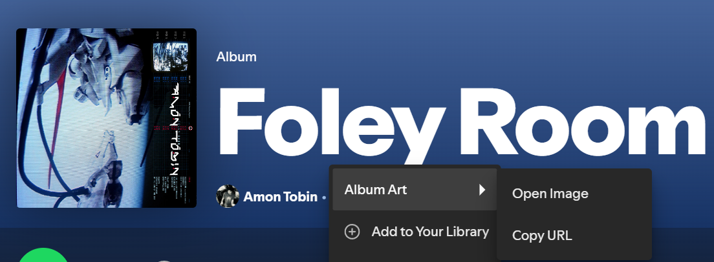
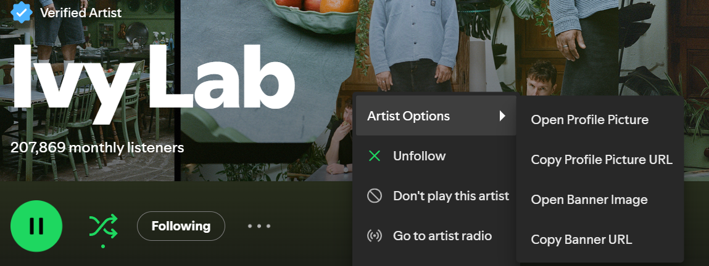

# Image Opener

> Access album art, artist photos, and more with right-click context menus

## Screenshots

### Album Art Context Menu


### Artist Banner Context Menu


## Features

- Right-click on any album/track to access full-size album artwork
- Right-click on artist pages to access profile pictures and banner images
- Works with now playing bar album art

## Installation

### Spicetify Marketplace

1. Install [Spicetify](https://spicetify.app/)
2. Install [Spicetify Marketplace](https://github.com/spicetify/spicetify-marketplace)
3. Open Spotify and navigate to Marketplace
4. Search for "Image Opener" and click Install

### Manual Installation

1. Download `Image_Opener.js` to your Spicetify extensions folder:
   - Windows: `%appdata%\spicetify\Extensions\`
   - Linux: `~/.config/spicetify/Extensions/`
   - MacOS: `~/.config/spicetify/Extensions/`

2. Run:
   ```
   spicetify config extensions Spotify_Image_Opener.js
   spicetify apply
   ```

## Usage

Simply right-click on images or content you want to interact with:

- Album covers: Access the full-resolution artwork
- Artist pages: Access the artist's profile picture and banner

## Author

Created by NightMortal

## License

MIT
